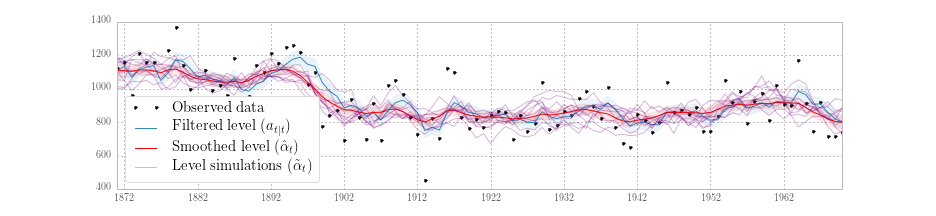
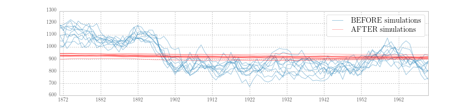

.. Introduction
.. Citation: :cite:``
.. Footnote: [#]_ 

.. _representation-in-python:

Representation in Python
------------------------

The basic guiding principle for translation of state space models into Python
is to allow users to focus on the specification aspect of their model rather
than on the machinery of efficient and accurate filtering and smoothing
computation. To do this, it applies the programmatic technique of object
oriented programming (OOP). While a full description and motivation of OOP is
beyond the scope of this paper, one of the primary benefits for our purposes
is that it facilitates organization and prevents the writing and rewriting of
the same or similar code. This feature is quite attractive in general, but as
will be shown below, state space models fit particularly well into - and reap
substantial benefits from - the object oriented paradigm. Once a state space
model has been specified, filtering, smoothing, a large part of parameter
estimation, and some postestimation results are standard; they depend only on
the generic form of the model given in :eq:`sspace` rather than the
specializations found in, for example, :eq:`arma11`, :eq:`llevel`, and
:eq:`rbc`).

The Python programming language is general-purpose, interpreted, dynamically
typed, and high-level. Relative to other programming languages commonly used
for statistical computation, it has both strengths and weaknesses. It lacks
the breadth of available statistical routines present in the R programming
language, but instead features a core stack of well-developed scientific
libraries. Since it began life as a general purpose programming language, it
lacks the native understanding of matrix algebra which makes MATLAB so easy to
begin working with (these features are available, but are provided by the
the Numeric Python (NumPy) and Scientific Python (SciPy) libraries) but has
more built-in features for working with text, files, web sites, and more. All
of Python, R, and MATLAB feature excellent graphing and plotting features and
the ability to integrate compiled code for faster performance.

Of course, anything that can be done in one language can in principle be done
in many others, so familiarity, style, and tradition play a substantial role in
determining which language is used in which discipline. There is much to
recommend R, MATLAB, Stata, Julia, and other languages. Nonetheless, it is
hoped that this paper will not only show how state space models can be
specified and estimated in Python, but also introduce some of the powerful and
elegent features of Python that make it a strong candidate for consideration in
a wide variety of statistical computing projects.

Object oriented programming
^^^^^^^^^^^^^^^^^^^^^^^^^^^

What follows is a brief description of the concepts of object oriented
programming. The content follows :cite:`wegner_concepts_1990`, which may be
consulted for more detail. The Python Language Reference may be consulted for
details on the implementation and syntax of object oriented programming
specific to Python.

Objects are "collections of operations that share a state"
(:cite:`wegner_concepts_1990`). Another way to put it is that objects are
collections of data (the state) along with functions that operate on or
otherwise make use of that data (the operations). In Python, the data held by
an object are called its *attributes* and the operations are called its
*methods*. An example of an object is a point in the Cartesian plane, where we
suppose that the "state" of the point is its coordinates in the plane and there
are two methods, one to change its :math:`x`-coordinate to :math:`x + dx`, and
one to change the :math:`y`-coordinate to :math:`y + dy`.

Classes are "templates from which objects can be created ... whereas the
[attributes of an] object represent *actual* variables, class
[attributes] are *potential*, being instantiated only when an object is
created" (*Ibid.*). The point object described above could be written in Python
code in the following way: first by defining a ``Point`` class:

::

    # This is the class definition. Object oriented programming has the concept
    # of inheritance, whereby classes may be "children" of other classes. The
    # parent class is specified in the parentheses. When defining a class with
    # no parent, the base class `object` is specified instead.
    class Point(object):

        # The __init__ function is a special method that is run whenever an
        # object is created. In this case, the initial coordinates are set to
        # the origin. `self` is a variable which refers to the object instance
        # itself.
        def __init__(self):
            self.x = 0
            self.y = 0

        def change_x(self, dx):
            self.x = self.x + dx

        def change_y(self, dy):
            self.y = self.y + dy

and then by creating a ``point_object`` object by instantiating that class:

::

    # An object of class Point is created
    point_object = Point()

    # The object exposes it's attributes
    print(point_object.x)  # 0

    # And we can call the object's methods
    # Notice that although `self` is the first argument of the class method,
    # it is automatically populated, and we need only specify the other
    # argument, `dx`.
    point_object.change_x(-2)
    print(point_object.x)  # -2

Object oriented programming allows code to be organized hierarchically through
the concept of class inheritance, whereby a class can be defined as an
extension to an existing class. The existing class is called the *parent* and
the new class is called the *child*. :cite:`wegner_concepts_1990` writes
"inheritance allows us to reuse the behavior of a class in the definition of
new classes. Subclasses of a class inherit the operations of their parent class
and may add new operations and new [attributes]".

Through the mechanism of inheritance, a parent class can be defined with a set
of generic functionality, and then many child classes can subsequently by
defined with specializations. Each child thus contains both the generic
functionality of the parent class as well as its own specific functionality. Of
course the child classes may have children of their own, and so on.

As an example, consider creating a new class describing vectors in
:math:`\mathbb{R}^2`. Since a vector can be described as an ordered pair of
coordinates, the ``Point`` class defined above could also be used to describe
vectors and allow users to modify the vector using the ``change_x`` and
``change_y`` methods. Suppose that we wanted to add a method to calculate the
length of the vector. It wouldn't make sense to add a length method to the
``Point`` class, since a point does not have a length, but we can create a new
``Vector`` class extending the ``Point`` class with the new method. In the code
below, we also introduce arguments into the class constructor (the ``__init__``
method).

::

    # This is the new class definition. Here, the parent class, `Point`, is in
    # the parentheses.
    class Vector(Point):

        def __init__(self, x, y):
            # Call the `Point.__init__` method to initialize the coordinates
            # to the origin
            super(Vector, self).__init__()

            # Now change to coordinates to those provided as arguments, using
            # the methods defined in the parent class.
            self.change_x(x)
            self.change_y(y)

        def length(self):
            # Notice that in Python the exponentiation operator is a double
            # asterisk, "**"
            return (self.x**2 + self.y**2)**0.5

    # An object of class Vector is created
    vector_object = Vector(1, 1)
    print(vector_object.length())  # 1.41421356237

Returning to state space models and Kalman filtering and smoothing, the object
oriented approach allows for separation of concerns, and prevents duplication
of effort. The base classes contain the functionality common to all state space
models, in particular Kalman filtering and smoothing routines, and child
classes fill in model-specific parameters into the state space representation
matrices. In this way, users need only specify the parts that are
absolutely necessary and yet the classes they define contain full state space
operations. In fact, many additional features beyond filtering and smoothing
are available through the base classes, including methods for estimation of
unknown parameters, summary tables, prediction and forecasting, model
diagnostics, simulation, and impulse response functions.

Basic representation
^^^^^^^^^^^^^^^^^^^^

In this section we present the first of two classes that most applications will
use.

The class ``dismalpy.ssm.Model`` (referred to as simply ``Model`` in what
follows) provides a direct interface to the state space functionality described
above. Thus it requires specification of the state space matrices (i.e. the
elements from :numref:`table-sspace`) and in return it provides a number of
built-in functions that can be called by users. The most important of these are
``loglike``, ``filter``, ``smooth``, and ``simulation_smoother``.

The first, ``loglike``, performs the Kalman filter recursions and returns the
joint loglikelihood of the sample. The second, ``filter``, performs the Kalman
filter recursions and returns an object holding the full output of the filter
(see :numref:`table-kfilter`), as well as the state space representation (see
:numref:`table-sspace`). The third, ``smooth``, performs Kalman filtering
and smoothing recursions and returns an object holding the full output of
the smoother (see :numref:`table-smoothers`) as well as the filtering output
and the state space representation. The last, ``simulation_smoother``, creates
a new object that can be used to create an arbitrary number of simulated state
and disturbance series (see :numref:`table-simsmoothers`).

As an example of the use of this class, consider the following code, which
constructs a local level model for the Nile data with known parameter values
(the next section will consider parameter estimation), and then applies the
above methods. Recall that to fully specify a state space model, all of the
elements from :numref:`table-sspace` must be set, and the Kalman filter must
be initialized. In the ``Model`` class, all state space elements are created
as zero matrices of the appropriate shapes, so often only the non-zero
elements need be specified. [#]_

::

    # To instantiate the object, provide the observed data (here `nile`)
    # and the dimension of the state vector
    nile_model_1 = dp.ssm.Model(nile, k_states=1)
    # The state space representation matrices are initialized to zeros,
    # and must be set to the values prescribed by the model

    # The design, transition, and selection matrices are fully fixed
    # by the local level model.
    nile_model_1['design', 0, 0] = 1.0
    nile_model_1['transition', 0, 0] = 1.0
    nile_model_1['selection', 0, 0] = 1.0

    # The observation and state disturbance covariance matrices are not
    # in general known; here we take values from Durbin and Koopman (2012)
    nile_model_1['obs_cov', 0, 0] = 15099.0
    nile_model_1['state_cov', 0, 0] = 1469.1

    # Initialize as approximate diffuse, and "burn" the first
    # loglikelihood value
    nile_model_1.initialize_approximate_diffuse()
    nile_model_1.loglikelihood_burn = 1

Notice that the approach did not create a subclass. Instead, it instantiated
the ``Model`` class directly as an object which was then manipulated. In this
case, this method was more convenient, although an equivalent approach
utilizing a subclass could have been used. For parameter estimation, below, the
approach utilizing a subclass is almost always preferrable. The following code
therefore specifies the same model as above, but utilizing a subclass approach.

::

    # Create a new class with parent dp.ssm.Model
    class BaseLocalLevel(dp.ssm.Model):
        
        # Recall that the constructor (the __init__ method) is
        # always evaluated at the point of object instantiation
        # Here we require a single instantiation argument, the
        # observed dataset, called `endog` here.
        def __init__(self, endog):
            
            # This calls the constructor of the parent class. This
            # line is analogous to the line
            # `nile_model_1 = dp.ssm.Model(nile, k_states=1)` in
            # previous example
            super(BaseLocalLevel, self).__init__(endog, k_states=1)
            
            # The below code mirrors the previous example, except
            # that instead of the object instance `nile_model_1`, we
            # use the self-referential object instance `self`.
            
            # Here we only set the generically known elements
            self['design', 0, 0] = 1.0
            self['transition', 0, 0] = 1.0
            self['selection', 0, 0] = 1.0

            self.initialize_approximate_diffuse()
            self.loglikelihood_burn = 1
            
    # Instantiate a new object
    nile_model_2 = BaseLocalLevel(nile)

    # Now, set the covariance matrices to the values 
    # specific to the nile model
    nile_model_2['obs_cov', 0, 0] = 15099.0
    nile_model_2['state_cov', 0, 0] = 1469.1

Either of the above approaches fully specifies the local level state space
model. At our disposal now are the methods provided by the ``Model`` class.
They can be applied as follows.

First, the ``loglike`` method returns a single number.

::

    # Evaluate the joint loglikelihood of the data
    print(nile_model_1.loglike())  # -632.537695048
    # or, we could equivalently use the second model with identical results
    print(nile_model_2.loglike())  # -632.537695048

The ``filter`` method returns an object from which filter output can be
retrieved.

::

    # Retrieve filtering output
    nile_filtered_1 = nile_model_1.filter()
    # print the filtered estimate of the unobserved level
    print(nile_filtered_1.filtered_state[0])         # [1103.34  ... 798.37]
    print(nile_filtered_1.filtered_state_cov[0, 0])  # [14874.41  ... 4032.16]

The ``smooth`` method returns an object from which smoother output can be
retrieved.

::

    # Retrieve smoothing output
    nile_smoothed_1 = nile_model_1.smooth()
    # print the smoothed estimate of the unobserved level
    print(nile_smoothed_1.smoothed_state[0])         # [1107.20 ... 798.37]
    print(nile_smoothed_1.smoothed_state_cov[0, 0])  # [4015.96  ... 4032.16]

Finally the ``simulation_smoother`` method returns an object that can be
used to simulate state or disturbance vectors via the ``simulate`` method.

::

    # Retrieve a simulation smoothing object
    nile_simsmoother_1 = nile_model_1.simulation_smoother()
    # Perform first set of simulation smoothing recursions
    nile_simsmoother_1.simulate()
    print(nile_simsmoother_1.simulated_state[0, :-1])  # [1000.10 ... 882.31]
    # Perform second set of simulation smoothing recursions
    nile_simsmoother_1.simulate()
    print(nile_simsmoother_1.simulated_state[0, :-1])  # [1153.62 ... 808.44]

:numref:`figure_3-model-nile` plots the observed data, filtered series,
smoothed series, and the simulated level from ten simulations, generated from
the above model.

.. _figure_3-model-nile:

   Filtered and smoothed estimates and simulatations of unobserved level for
   Nile data.

The ``Model`` class is thus sufficient for performing filtering, smoothing,
etc. operations on a *known* model, but it is not convenient for the estimation
of unknown parameters. A second class with estimation in mind is described in
the following section.

.. [#] More specifically, potentially time-varying matrices are created as
       zero matrices of the appropriate non-time-varying shape. If a
       time-varying matrix is required, the whole matrix must be re-created in
       the appropriate time-varying shape before individual elements may be
       modified.

Representation for parameter estimation
^^^^^^^^^^^^^^^^^^^^^^^^^^^^^^^^^^^^^^^

The introduction of parameter estimation into the Python representation of a
state space model will require practical implementation of the concepts that
were introduced in order to consider parameter estimation in the state space
model. These concepts are (1) the idea of a mapping from
parameter values to system matrices, and (2) the specification of initial
parameter values. Although there are many ways to implement these, what follows
is the convention used throughout; for compatibility with existing classes (for
example the maximum likelihood estimation helper class
``dismalpy.ssm.MLEModel``) it is recommended that users do not deviate from
them.

In the above example using the subclass approach, the fixed elements of the
state space representation were set in the class constructor (the ``__init__``
method) and the elements corresponding to parameter values were set later. This
is the pattern that will be used; in particular we will add a new method to the
class, an ``update`` method, that will accept as its argument the full vector
of parameters :math:`\psi` and will update the system matrices as appropriate.
With this we have implemented the mapping described above. Second, we will add
a new attribute to the class, called ``start_params``, that will hold the
vector of initial parameter values. [#]_

The following code re-writes the above local level implementation to use these
two new features.

::

    class LocalLevel(dp.ssm.Model):

        # Define the initial parameter vector; see update() below for a note
        # on the required order of parameter values in the vector
        start_params = [1.0, 1.0]
        
        # Define the fixed state space elements in the constructor
        def __init__(self, endog):
            super(LocalLevel, self).__init__(endog, k_states=1)

            self['design', 0, 0] = 1.0
            self['transition', 0, 0] = 1.0
            self['selection', 0, 0] = 1.0

            self.initialize_approximate_diffuse()
            self.loglikelihood_burn = 1

        def update(self, params):
            # Using the parameters in a specific order in the update method
            # implicitly defines the required order of parameters
            self['obs_cov', 0, 0] = params[0]
            self['state_cov', 0, 0] = params[1]

Notice that in the code above, only the fixed state space elements common to
all local level models was set in the constructor.The two variance parameters
remain to be set, using the ``update`` method, after the object is
instantiated with a specific dataset:

::

    # Instantiate a new object
    nile_model_3 = LocalLevel(nile)
    # Now, update the model with the values specific to the nile model
    nile_model_3.update([15099.0, 1469.1])

    print(nile_model_3.loglike())  # -632.537695048

    # Try updating with a different set of values, and notice that the
    # evaluated likelihood changes.
    nile_model_3.update([10000.0, 1.0])

    print(nile_model_3.loglike())  # -687.5456216

Additional remarks
^^^^^^^^^^^^^^^^^^

Several additional remarks are merited about the implementation that is
available when using or creating subclasses of the base classes.

First, if the model is time-invariant, then a check for convergence will be
used at each step of the Kalman filter iterations. Once convergence has been
achieved, the converged state disturbance covariance matrix, Kalman gain, and
forecast error covariance matrix are used at all remaining iterations,
reducing the computational burden. The tolerance for determining convergence is
controlled by the ``tolerance`` attribute, which is initially set to
:math:`10^{-19}` but can be changed by the user. For example, to disable the
use of converged values in the above Nile model one could use the code
``nile_model_3.tolerance = 0``.

Second, two recent innovations in Kalman filtering are available to handle
large-dimensional observations. These include the univariate filtering approach
of :cite:`koopman_fast_2000` and the collapsed approach of
:cite:`jungbacker_likelihood-based_2014`. The use of these approaches are
controlled by the ``set_filter_method`` method. For example, to enable
both of these approaches in the Nile model, one could use the code
``nile_model_3.set_filter_method(filter_univariate=True, filter_collapsed=True)``
(this is just for illustration, since of course there is only a single variable
in that model meaning that these options would have no practical effect). The
univariate filtering method is enabled by default, but the collapsed approach
is not.

Next, options to enable conservation of computer memory (RAM) are available,
and are controllable via the ``set_conserve_memory`` method. It should be noted
that the usefulness of these options depends on the analysis required by the
user, because smoothing requires all filtering values and simulation smoothing
requires all smoothing and filtering values. However, in maximum likelihood
estimation or Metropolis-Hastings posterior simulation, all that is required is
the joint likelihood value. One might enable memory conservation until
optimal parameters have been found, and then disable it so as to calculate any
filtered and smoothed values of interest. In Gibbs sampling MCMC approaches,
memory conservation is not available because the simulation smoother is
required.

Fourth, predictions and impulse response functions are immediately
available for any state space model through the filter results object (obtained
as the returned value from a ``filter`` call), through the ``predict`` and
``impulse_responses`` methods.

Fifth, the Kalman filter (and smoothers) are fully equipped to handle missing
observation data; no special code is required.

Finally, before moving on to specific parameter estimation methods, it is
important to note that the simulation smoother object created via the
``simulation_smoother`` method generates simulations based on the state space
matrices as they are defined *when the simulation is performed* and not when
the ``simulate`` method is called. This will be important when considering
Gibbs sampling MCMC parameter estimation methods, below. As an illustration,
consider the following code:

::

    # BEFORE: Perform some simulations with the original parameters
    nile_model_3.update([15099.0, 1469.1])
    nile_simsmoother_3.simulate()
    # ...

    # AFTER: Perform some new simulations with new parameters
    nile_model_3.update([10000.0, 1.0])
    nile_simsmoother_3.simulate()
    # ...

:numref:`figure_3-params-simul-nile` plots ten simulations generated during the
BEFORE period, and ten simulations from the AFTER period. It is clear that they
are simulating different series, reflecting the different parameters values in
place at the time of simulation.

.. _figure_3-params-simul-nile:

   Simulations of the unobserved level for Nile data under two different
   parameter sets.

.. [#] It may seem restrictive to require the initial parameter value to be a
       a class attribute, which is set to a specific value. In practice, the
       attribute can be replaced with a class *property*, allowing dynamic
       creation of the attribute's value. In this way the initial parameter
       vector for an ARMA(p,q) model could, for example, be generated using
       ordinary least squares.

Practical considerations
^^^^^^^^^^^^^^^^^^^^^^^^

As described before, two practical considerations with the Kalman filter are
numerical stability and performance. Briefly discussed were the availability of
a square-root filter and the use of compiled computer code. In practice, the
square-root filter is rarely required, and this Python implementation does not
use it. One good reason for this is that "the amount of computation required is
substantially larger" (:cite:`durbin_time_2012`), and acceptable numerical
stability for most models is usually achieved via forcing symmetry of the state
covariance matrix (see :cite:`grewal_kalman_2014`, for example).

High performance is achieved primarily through the use of Cython
(:cite:`behnel_cython:_2011`) which allows suitably modified Python code to be
compiled to C, in some cases (such as the current one) dramatically improving
performance. Also, as described in the preceding section, recent advances in
filtering with large-dimensional observations are available. Note that the
use of compiled code for performance-critical computation is also pursued in
several of the other Kalman filtering implementations mentioned in the
introduction.

An additional practical consideration whenever computer code is at issue is the
possibility of programming errors ("bugs"). :cite:`mccullough_numerical_1999`
emphasize the need for tests ensuring *accurate* results, as well as good
documentation and the availability of source code so that checking for bugs is
possible. The source code for this implementation is available, with reasonably
extensive inline comments describing procedures. Furthermore, even though the
spectre of bugs cannot be fully exorcised, several hundred "unit tests" have
been written, and are available for users to run themselves, comparing output
to known results from a variety of outside sources. These tests are run
continuously with the software's development to prevent errors from creeping
in.

At this point, we once again draw attention to the separation of
concerns made possible by the implementation approach pursued here. Although
writing the code for a conventional Kalman filter is relatively trivial,
writing the code for a Kalman filter, smoother, and simulation smoother using
the univariate and collapsed approaches, properly allowing for missing data,
and in a compiled language to achieve acceptable performance is not. And yet,
for models in state space from, the solution, once created, is entirely
generic. The use of an object oriented approach here is what allows users to
have the best of both worlds: classes can be custom designed using only Python
and yet they contain methods (``loglike``, ``filter``, etc.) which have been
written and compiled for high performance, and tested for accuracy.

Example models
^^^^^^^^^^^^^^

In this section, we provide code describing the example models in the previous
sections. This code is provided to illustrate the above principles in specific
models, and it is not necessarily the best way to estimate these models. For
example, it is more efficient to develop a class to handle all ARMA(p,q) models
rather than separate classes for different orders.

.. todo::

    Put a reference in here to the SARIMAX class.

ARMA(1, 1) model
""""""""""""""""

The following code is a straightforward translation of :eq:`arma11`. Notice
that here the state dimension is 2 but the dimension of the state disturbance
is only 1; this is represented in the code by setting ``k_states=2`` but
``k_posdef=1``. [#]_ Also demonstrated is the possibility of specifying the
Kalman filter initialization in the class construction call
(``initialization='stationary'``), since the model is assumed to be
stationary. [#]_

::

    class ARMA11(dp.ssm.Model):
        
        start_params = [0, 0, 1]

        def __init__(self, endog):
            super(ARMA11, self).__init__(
                endog, k_states=2, k_posdef=1, initialization='stationary')
            
            self['design', 0, 0] = 1.
            self['transition', 1, 0] = 1.
            self['selection', 0, 0] = 1.

        def update(self, params):
            self['design', 0, 1] = params[1]
            self['transition', 0, 0] = params[0]
            self['state_cov', 0, 0] = params[2]

    # Example of instantiating a new object, updating the parameters to the
    # starting parameters, and evaluating the loglikelihood
    inf_model = ARMA11(inf)
    inf_model.update(inf_model.start_params)
    inf_model.loglike()  # -1545.0987090041408

Local level model
"""""""""""""""""

The class for the local level model was defined in the previous section.

Real business cycle model
"""""""""""""""""""""""""

The real business cycle model is specified by :eq:`rbc`. It again has a
state dimension of 2 and a state disturbance dimension of 1, and again the
process is assumed to be stationary. Unlike the previous examples, here the
parameters of the model do not map one-to-one to elements of the system
matrices. As described in the definition of the RBC model, the thirteen
reduced form parameters found in the state space matrices are non-linear
functions of combinations of the six structural parameters. We want to set up
the model in terms of the structural parameters and use the ``update`` method
to perform the appropriate transformations to retrieve the reduced form
parameters. This is important because the theory does not allow the reduced
form parameters to vary arbitrarily; in particular, only certain combinations
of the reduced form parameters are consistent with generation through the model
from the underlying structural parameters.

Give reduced form parameters, the specification of the state space model itself
is trivial, but estimation of the reduced form model requires solution of the
structural model for the reduced form parameters in terms of the structural
parameters. This requires the solution of a linear rational expectations model,
which is beyond the scope of this paper. This particular RBC model can be
solved using the method of :cite:`blanchard_solution_1980`; more general
solution methods exist for more general models (see for example
:cite:`klein_using_2000` and :cite:`sims_solving_2002`).

Regardless of the method used, for many linear (or linearized) models, the
solution will be in state space form and so the state space matrices can be
updated with the reduced form parameters. The following code snippet is not
complete, but shows the general formulation in Python.

.. todo::
    
    Add a note that the full code is available in the appendix, and in
    a companion file / iPython notebook.

::

    class SimpleRBC(dp.ssm.Model):
        
        start_params = [...]
        
        def __init__(self, endog):
            super(SimpleRBC, self).__init__(
                endog, k_states=2, k_posdef=1, initialization='stationary')
            
            # Initialize RBC-specific variables, parameters, etc.
            # ...

            # Setup fixed elements of the statespace matrices
            self['selection', 1, 0] = 1
            
        def solve(self, structural_params):
            # Solve the RBC model
            # ...

        def update(self, params):        
            params = super(SimpleRBC, self).update(params, transformed)
            
            # Reconstruct the full parameter vector from the
            # estimated and calibrated parameters
            structural_params = ...
            measurement_variances = ...
            
            # Solve the model
            design, transition = self.solve(structural_params)
            
            # Update the statespace representation
            self['design'] = design
            self['obs_cov', 0, 0] = measurement_variances[0]
            self['obs_cov', 1, 1] = measurement_variances[1]
            self['obs_cov', 2, 2] = measurement_variances[2]
            self['transition'] = transition
            self['state_cov', 0, 0] = structural_params[...]

.. [#] The dimension of the state disturbance is named ``k_posdef`` because the
       selected state disturbance vector is given not by :math:`\eta_t` but by
       :math:`R_t \eta_t`. The dimension of the selected state disturbance
       vector is always equal to the dimension of the state, but the selected
       state disturbance covariance matrix will be have
       ``k_states - k_posdef`` zero-eigenvalues. Thus the dimension of
       the state disturbance gives the dimension of the subset of the selected
       state disturbance for which a positive definite covariance matrix.

.. [#] Of course the assumption of stationarity would be violated for certain
       parameter values, for example if :math:`\phi = 1`. This has important
       implications for parameter estimation, where we typically want to only
       allow parameters inducing a stationary model, and is discussed in the
       specific sections on parameter estimation.
