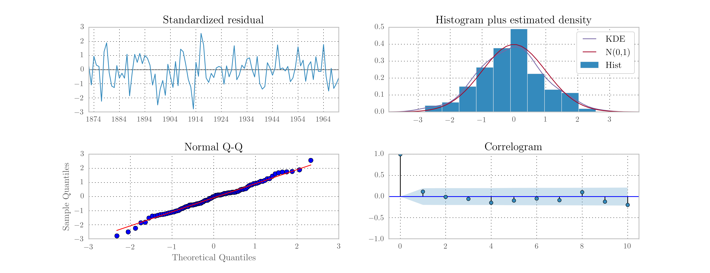
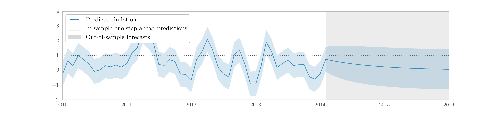
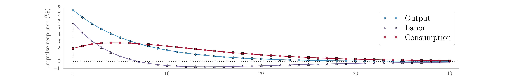
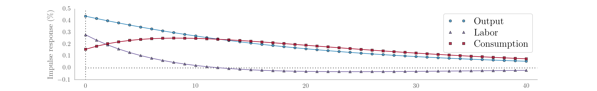
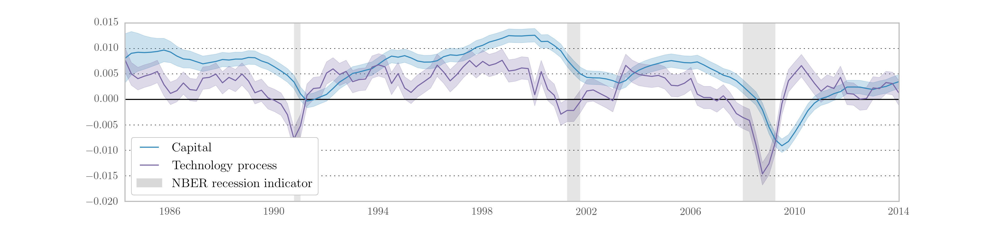

.. Introduction
.. Citation: :cite:``
.. Footnote: [#]_ 

Maximum Likelihood Estimation
-----------------------------

Classical estimation of parameters in state space models is facilitated by the
availability of the likelihood as a byproduct of the filtering recursions.
Given a set of initial parameters, numerical maximization techniques,
often quasi-Newton methods, can be applied to find the set of parameters
that maximize (locally) the likelihood function,
:math:`\mathcal{L}(Y_n \mid \psi)`. In this section we describe how to apply
maximum likelihood estimation (MLE) to state space models in Python. First we
describe a direct approach using the classes defined in the previous section.
Second, we show how integration with the Python package Statsmodels
(:cite:`seabold_statsmodels:_2010`) can be used to great effect to streamline
estimation.

Statsmodels is a library for statistical and econometric modeling using
classical techniques. Its goals are comparable in many ways to those of the
commercial econometric software like Stata in that it provides a range of
out-of-the-box models that require little technical knowledge to apply to data.
It includes least squares regression models, generalized linear models (GLM),
robust linear models, discrete choice models, contrast analysis, and time-series
analysis. Recent and forthcoming additions include mixed generalized linear
models (mixed GLM) and general estimating equations (GEE). In addition, a
version of the state space implementation described in this paper specialized
to the classical estimation setting is forthcoming in Statsmodels.

.. todo::

    Give a link / citation to the Statsmodels-specific version of this paper,
    and also reference in the footnote below.

We introduce a new parent class ``dp.ssm.MLEModel`` (hereafter simply
``MLEModel``) that transparently handles the integration. Models extending from
the ``MLEModel`` class can painlessly perform maximum likelihood estimation via
a new ``fit`` method. In addition, summary tables, postestimation results, and
model diagnostics are available.

Direct approach
^^^^^^^^^^^^^^^

Numerical optimziation routines in Python are available through the Python
package SciPy (:cite:`jones_scipy:_2001`). Generically, these are in the
form of minimizers that accept a function and a set of starting parameters and
return the set of parameters that (locally) minimize the function. There are a
number of available algorithms, including the popular BFGS
(Broyden–Fletcher–Goldfarb–Shannon) method. As is usual when minimization
routines are available, in order to maximize the (log) likelihood, we minimize
its negative.

The code below demonstrates how to apply maximum likelihood estimation to the
``LocalLevel`` class defined in the previous section for the Nile dataset. In
this case, because we have not bothered to define good starting parameters, we
use the Nelder-Mead algorithm which can be more robust than BFGS, although it
may converge more slowly.

::

    # Import the generic minimization function from scipy
    from scipy.optimize import minimize

    # Create a new function to return the negative of the loglikelihood
    nile_model_4 = LocalLevel(nile)
    def func(params):
        nile_model_4.update(params)
        return -nile_model_4.loglike()

    # Perform numerical optimization
    output = minimize(func, nile_model_4.start_params, method='Nelder-Mead')
    
    print(output.x)  # [ 15108.31   1463.55]
    nile_model_4.update(output.x)
    print(nile_model_4.loglike())  # -632.537685587

The maximizing parameters are very close to those reported by
:cite:`durbin_time_2012` and achieve a negligibly higher loglikelihood
(-632.53769 versus -632.53770).

Integration with Statsmodels
^^^^^^^^^^^^^^^^^^^^^^^^^^^^

While likelihood maximization itself can be performed relatively easily, in
practice there are often many other desired quantities, for example measures
of parameter uncertainty (standard errors and confidence intervals). Another
issue that arises in practice is that it is most convenient to allow the
numerical optimizer to choose parameters across the entire real line. This
means that some combinations of parameters chosen by the optimizer may lead to
an invalid model specification. It is possible in some cases to use an
optimization procedure with constraints or bounds, but it is almost always
easier to allow the optimizer to choose in an unconstrained way and then to
transform the parameters to fit the model. The implementation of parameter
transformations will be discussed at greater length below.

While there is no barrier to calculating those quantities or implementing these
transformations, the calculations are standard and there is no reason for each
user to implement them separately. Again we turn to the principle of separation
of concerns made possible through the object oriented programming approach,
this time by making use of the tools available in the Python package
Statsmodels.

Creating a model that features integration with the Statsmodels code base is as
simple as using ``dp.ssm.MLEModel`` as the parent class instead of
``dp.ssm.Model``. As the name suggests, it contains additional features
specific to maximum likelihood estimation while at the same time retaining all
of the features described above. [#]_ In particular, a new method, ``fit``, is
available which automatically performs maximum likelihood estimation using the
starting parameters defined in the ``start_params`` attribute (see above) and
returns a results object.

Because the emphasis has shifted to evaluating the model in terms of
parameters, it is important to note that the ``loglike``, ``filter``,
``smooth``, and ``simulation_smoother`` methods now require as their first
argument the parameter vector at which to perform the operation.

The following code redefines the local level model to
use the ``MLEModel`` base class; it is identical to the previous definition
except for three changes: (1) references to ``Model`` have been replaced by
references to ``MLEModel``, (2) the ``update`` method has been augmented
to allow for parameter transformations, and (3) a new attribute ``param_names``
has been added which augments output with descriptive parameter names. A brief
explanation about the changes to the ``update`` method follows.

First, a new argument has been added, describing whether or not the values in
the ``params`` vector are considered to be *transformed* (i.e. in the space of
parameters valid for the model) or not (i.e. in the unconstrained space of
parameters used by the optimizer). Second, a new line replaces the ``params``
vector with the output from the ``update`` method of the parent class
(``MLEModel``). If the parameters were *not* transformed, the parent ``update``
method calls the appropriate transformation functions (see below for details)
and returns the transformed parameters.

::

    class BaseMLELocalLevel(dp.ssm.MLEModel):
        start_params = [1.0, 1.0]
        param_names = ['obs.var', 'level.var']

        def __init__(self, endog):
            super(BaseMLELocalLevel, self).__init__(endog, k_states=1)

            self['design', 0, 0] = 1.0
            self['transition', 0, 0] = 1.0
            self['selection', 0, 0] = 1.0

            self.initialize_approximate_diffuse()
            self.loglikelihood_burn = 1

        def update(self, params, transformed=True):
            # Transform the parameters if they are not yet transformed
            params = super(BaseMLELocalLevel, self).update(params, transformed)

            self['obs_cov', 0, 0] = params[0]
            self['state_cov', 0, 0] = params[1]

With this new definition, we can instantiate our model and perform maximum
likelihood estimation. As one feature of the integration with Statsmodels, the
result object has a ``summary`` method that prints a table of results:

::

    nile_mlemodel_1 = BaseMLELocalLevel(nile)
    
    # Notice that to call loglike, we now need to specify parameters, but we
    # no longer need to call `update` beforehand.
    print(nile_mlemodel_1.loglike([15099.0, 1469.1]))  # -632.537695048

    # Again we use Nelder-Mead; now specified as method='nm'
    nile_mleresults_1 = nile_mlemodel_1.fit(method='nm', maxiter=1000)
    
    print(nile_mleresults_1.summary())

::

    ==============================================================================
    Dep. Variable:                 volume   No. Observations:                  100
    Model:                  MLELocalLevel   Log Likelihood                -632.538
    Date:                Sat, 12 Sep 2015   AIC                           1269.075
    Time:                        16:07:24   BIC                           1274.286
    Sample:                    01-01-1871   HQIC                          1271.184
                             - 01-01-1970                                         
    Covariance Type:                  opg                                         
    ==============================================================================
                     coef    std err          z      P>|z|      [0.025      0.975]
    ------------------------------------------------------------------------------
    obs.var     1.511e+04   2586.966      5.840      0.000       1e+04    2.02e+04
    level.var   1463.5474    843.718      1.735      0.083    -190.109    3117.203
    ===================================================================================
    Ljung-Box (Q):                       36.00   Jarque-Bera (JB):                 0.05
    Prob(Q):                              0.65   Prob(JB):                         0.98
    Heteroskedasticity (H):               0.61   Skew:                            -0.03
    Prob(H) (two-sided):                  0.16   Kurtosis:                         3.08
    ===================================================================================

    Warnings:
    [1] Covariance matrix calculated using the outer product of gradients.

A second feature is the availability of model diagnostics. Test statistics for
tests of the standardized residuals for normality, heteroskedasticity, and
serial correlation are reported at the bottom of the summary output. Diagnostic
plots can also be produced using the ``plot_diagnostics`` method, illustrated
in :numref:`figure_4-diag-nile`. [#]_ Notice that Statsmodels is aware of the
date index of the Nile dataset and uses that information in the summary table
and diagnostic plots.

.. _figure_4-diag-nile:

   Diagnostic plots for standardised residuals after maximum likelihood
   estimation on Nile data.

A third feature is the availability of forecasting (through the
``get_forecasts`` method) and impulse response functions (through the
``impulse_responses`` method). Due to the nature of the local level model these
are uninteresting here, but will be exhibited in the ARMA(1,1) and real
business cycle examples below.

.. [#] An alternative is to use ``statsmodels.tsa.statespace.MLEModel`` as the
       parent class. This has the benefit that state space models can be
       estimated using the Statsmodels package alone but has the downside that
       some advanced features described in this paper are not yet available
       in that package. However, if all one wants to do is perform maximum
       likelihood estimation it is perfectly sufficient, and all of the code
       provided in this section will work equally well with this parent class.

.. [#] See sections 2.12 and 7.5 of :cite:`durbin_time_2012` for a description
       of the standardized residuals and the definitions of the provided
       diagnostic tests.

Parameter transformations
"""""""""""""""""""""""""

As mentioned above, parameter transformations are an important component of
maximum likelihood estimation in a wide variety of cases. For example, in the
local level model above the two estimated parameters are variances, which
cannot theoretically be negative. Although the optimizer avoided the
problematic regions in the above example, that will not always be the case. As
another example, ARMA models are typically assumed to be stationary. This
requires coefficients that permit inversion of the associated lag polynomial.
Parameter transformations can be used to enforce these and other
restrictions.

If an unconstrained variance parameter is squared the transformed
variance parameter will always be positive. :cite:`monahan_note_1984` and
:cite:`ansley_note_1986` describe transformations sufficient to induce
stationarity in the univariate and multivariate cases, respectively, by taking
advantage of the one-to-one correspondence between lag polynomial coefficients
and partial autocorrelations. [#]_

For practical reasons, it is strongly preferred that the transformation
function have a well-defined inverse so that starting parameters can
be specified in terms of the model space and then "untransformed" to the
appropriate values in the unconstrained space.

Implementing parameter transformations when using ``MLEModel`` as the base
class is as simple as adding two new methods: ``transform_params`` and
``untransform_params`` (if no parameter transformations as required, these
methods can simply be omitted from the class definition). The following code
redefines the local level model again, this time to include parameter
transformations to ensure positive variance parameters. [#]_

::

    class MLELocalLevel(dp.ssm.MLEModel):
        start_params = [1.0, 1.0]
        param_names = ['obs.var', 'level.var']

        def __init__(self, endog):
            super(MLELocalLevel, self).__init__(endog, k_states=1)

            self['design', 0, 0] = 1.0
            self['transition', 0, 0] = 1.0
            self['selection', 0, 0] = 1.0

            self.initialize_approximate_diffuse()
            self.loglikelihood_burn = 1
            
        def transform_params(self, params):
            return params**2
        
        def untransform_params(self, params):
            return params**0.5

        def update(self, params, transformed=True):
            # Transform the parameters if they are not yet transformed
            params = super(MLELocalLevel, self).update(params, transformed)

            self['obs_cov', 0, 0] = params[0]
            self['state_cov', 0, 0] = params[1]

All of the code given above then applies equally to this new model, except that
this class is robust to the optimizer selecting negative parameters.

.. [#] The transformations to induce stationarity are made available in this
       package as the functions
       ``dp.ssm.tools.constrain_stationary_univariate`` and
       ``dp.ssm.tools.constrain_stationary_multivariate``. Their inverses are
       also available, with the obvious name changes.

.. [#] Note that in Python, the exponentiation operator is ``**``.

Example models
^^^^^^^^^^^^^^

In this section, we extend the code from :ref:`representation-in-python` to
allow for maximum likelihood estimation through Statsmodels integration.

.. todo::

    Put a reference in here to the out-of-the-box models / section.

ARMA(1, 1) model
""""""""""""""""

::

    from dismalpy.ssm.tools import (constrain_stationary_univariate, unconstrain_stationary_univariate)

    class ARMA11(dp.ssm.MLEModel):
        start_params = [0, 0, 1]
        param_names = ['phi', 'theta', 'sigma2']

        def __init__(self, endog):
            super(ARMA11, self).__init__(
                endog, k_states=2, k_posdef=1, initialization='stationary')
            
            self['design', 0, 0] = 1.
            self['transition', 1, 0] = 1.
            self['selection', 0, 0] = 1.

        def transform_params(self, params):
            phi = constrain_stationary_univariate(params[0:1])
            theta = constrain_stationary_univariate(params[1:2])
            sigma2 = params[2]**2
            return np.r_[phi, theta, sigma2]
        
        def untransform_params(self, params):
            phi = unconstrain_stationary_univariate(params[0:1])
            theta = unconstrain_stationary_univariate(params[1:2])
            sigma2 = params[2]**0.5
            return np.r_[phi, theta, sigma2]
            
        def update(self, params, transformed=True):
            # Transform the parameters if they are not yet transformed
            params = super(ARMA11, self).update(params, transformed)
            
            self['design', 0, 1] = params[1]
            self['transition', 0, 0] = params[0]
            self['state_cov', 0, 0] = params[2]

The parameters can now be easily estimated via maximum likelihood as above.
This model also allows us to demonstrate the prediction and forecasting
features provided by the Statsmodels integration. In particular, we use the
``get_prediction`` method to retrieve a prediction object that gives in-sample
one-step-ahead predictions and out-of-sample forecasts, as well as confidence
intervals. :numref:`figure_4-forecast-inf` shows a graph of the output.

::

    inf_model = ARMA21(inf)
    inf_results = inf_model.fit()

    inf_forecast = inf_results.get_prediction(start='2010-01-01', end='2017-01-01')
    print(inf_forecast.predicted_mean)  # [2010-01-01   -0.000747 ...
    print(inf_forecast.conf_int())      # [2010-01-01   -0.006891  0.005398 ...

.. _figure_4-forecast-inf:

   In-sample one-step-ahead predictions and out-of-sample forecasts for
   ARMA(1,1) model on US CPI inflation data.

If only out-of-sample forecasts had been desired, the ``get_forecasts``
method could have been used instead, and if only the forecasted values had
been desired (and not additional results like confidence intervals), the
methods ``predict`` or ``forecast`` could have been used.

Local level model
"""""""""""""""""

See the previous sections for the Python implementation of the local level
model.

Real business cycle model
"""""""""""""""""""""""""

Due to the the complexity of the model, the full code for the model is too
long to display inline, but it is provided in the appendices. This code
implements the real business cycle model in a class named ``SimpleRBC``, and
allows some of the structural parameters to be estimated and some to be
calibrated (set to specific values).

Often in structural models one of the outcomes of interest is the time paths of
the observed variables following a hypothetical structural shock; these time
paths are called impulse response functions, and they can be generated for any
state space model.

In the first application, we will calibrate all of the structural parameters to
the values suggested in :cite:`ruge-murcia_methods_2007` and simply estimate
the measurement error variances (these do not affect the model dynamics or the
impulse responses). Once the model has been estimated, the
``impulse_responses`` method can be used to generate the time paths.

.. todo::

    Put in exactly where the code is.

::

    # Calibrate everything except measurement variances
    calibrated = {
        'discount_rate': 0.95,
        'disutility_labor': 3.0,
        'capital_share': 0.36,
        'depreciation_rate': 0.025,
        'technology_shock_persistence': 0.85,
        'technology_shock_var': 0.04**2
    }
    calibrated_mod = SimpleRBC(rbc_data, calibrated=calibrated)
    calibrated_res = calibrated_mod.fit()

    calibrated_irfs = calibrated_res.impulse_responses(40, orthogonalized=True)

The calculated impulse responses are displayed in
:numref:`figure_4-calibrated-irf`. By calibrating fewer parameters we can
expand estimation to include some of the structural parameters. For example,
we may consider also estimating the two parameters describing the technology
shock. Implementing this requires only the obvious changes to the above code.
The impulse responses corresponding to this second exercise are displayed
in :numref:`figure_4-estimated-irf`. [#]_

.. _figure_4-calibrated-irf:

   Impulse response functions corresponding to a fully calibrated RBC model.

.. _figure_4-estimated-irf:

   Impulse response functions corresponding to a partially estimated RBC model.

Recall that the RBC model has three observables, output, labor, and
consumption, and two unobserved states, capital and the technology process. The
Kalman filter provides optimal estimates of these unobserved series at time
:math:`t` based on on all data up to time :math:`t`, and the state smoother
provides optimal estimates based on the full dataset. These can be retrieved
from the results object. :numref:`figure_4-estimated-states` displays the
smoothed state values and confidence intervals for the partially estimated
case.

.. _figure_4-estimated-states:

   Smoothed estimates of capital and the technology process from the partially
   estimated RBC model.

.. [#] We note again that this example is merely by way of illustration; it
       does not represent best-practices for careful RBC estimation.